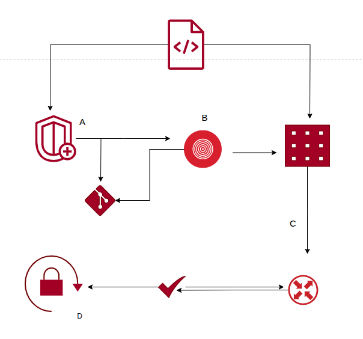
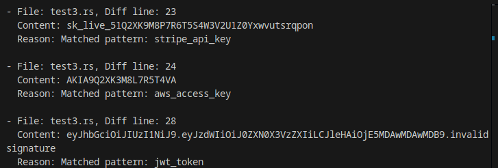

<div align="center"> <b>A lightweight pre-commit safety check </b></div>
<br>

[](https://opensource.org/licenses/MIT)
[](https://www.gnu.org/software/bash/)
[](https://www.python.org/)

## What SecureGitX does?

- Stops common secret patterns (API keys, tokens, DB URLS) from being committed.
- Detect sensitive filenames and warns or blocks commits 
- Recommend Github no-reply email
- Generates `.gitignore` based on detected project type.
- Installable as pre-commit hook to make checks automatic 

## Architecture:


## Quick start 

### Installation 


``` bash
# Download the script
curl -L https://raw.githubusercontent.com/peroxile/SecureGitX/main/bin/securegitx.sh -o securegitx.sh

# Make it executable 
chmod +x securegitx.sh

# Optional: Move to your PATH
sudo mv securegitx.sh /usr/local/bin/securegitx
```

### Mode 1

```bash
# Run security checks in your repo
./securegitx.sh

# Validate and commit:

./securegitx.sh "feat: add anything"
```

### Mode 2
```bash
# One-time setup
./securegitx.sh --install

# Now just use normal git 
git add src/
git commit -m "feat: add feature"  # SecureGitX runs automatically!


# Remove hook:
securegitx --uninstall

# Skip hook: 
git commit -m "your message" --no-verify

```

### Sample 


<div style="border-left:4px solid #0084ff; padding:8px; background:#fff3;">
<strong>Note:</strong> Wrapper folder must be moved to the project Directory to ensure secrets detection.
</div>