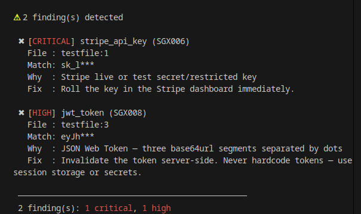

<div align="center">

**Stop secrets before they leave your machine.**

[](https://opensource.org/licenses/Apache-2.0)
[](https://www.python.org/)
[](https://github.com/peroxile/SecureGitX/actions)

</div>

---

SecureGitX is a local first pre-commit secret scanner. It inspects your staged changes before every `git commit` and blocks the commit if it finds API keys, tokens, credentials, or sensitive filenames.

---

## Install

```sh
pip install git+https://github.com/peroxile/SecureGitX.git
```

## One Liner 

```sh
curl -fsSL https://raw.githubusercontent.com/peroxile/SecureGitX/main/scripts/install.sh | bash
```

Or clone and install locally:

```sh
git clone https://github.com/peroxile/SecureGitX.git
cd SecureGitX
pip install -e ".[dev]"
```

Requires Python 3.10+.

---

## Quick start

```sh
# 1. Set up your repo (creates config, installs hook, generates .gitignore)
securegitx init
securegitx hook install

# 2. Work normally — the hook evokes automatically on every commit
git add src/
git commit -m "feat: add login"

# Or use SecureGitX directly to scan and commit in one step
securegitx "feat: add login"
```

From this point, any commit containing a secret is blocked with a clear message showing the file, line, rule matched, and what to do next.



---

## How it works

```
git commit
    │
    ▼
pre-commit hook
    │
    ├── scan staged filenames 
    ├── scan staged diff    
    ├── entropy check 
    │
    ├── findings above threshold?
    │       YES → commit blocked
    │       NO  → commit proceeds
```

## What it detects

API keys, tokens, credentials, and sensitive filenames across 20+ named rules — AWS, GitHub, Stripe, Google OAuth, JWTs, Slack tokens, Firebase keys, PEM headers, database URLs, SSH keys, and `.env` files.