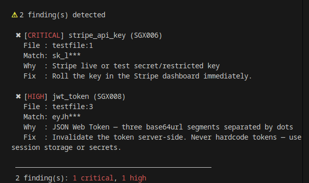

<div align="center">

[](https://opensource.org/licenses/Apache-2.0)
[](https://www.python.org/)
[](https://github.com/peroxile/SecureGitX/actions)

</div>

---

SecureGitX is a local first pre-commit secret scanner that blocks API keys, tokens, credentials, or sensitive filenames before they get committed.

---

## Install

```sh
pip install git+https://github.com/peroxile/SecureGitX.git
```

## One Liner 

```sh
curl -fsSL https://raw.githubusercontent.com/peroxile/SecureGitX/main/scripts/install.sh | bash
```

Or clone and install locally:

```sh
git clone https://github.com/peroxile/SecureGitX.git
cd SecureGitX
pip install -e ".[dev]"
```

Requires Python 3.10+.

---

## Quick start

```sh
#  Initialize your repo
securegitx init
securegitx hook install
```

If a secret is found, the commit is blocked with details on what was detected and how to fix it.

---



---

## How it works

```
git commit → pre-commit hook → scan filenames + diff + entropy
                                   │
                    ┌──────────────┴──────────────┐
                    ▼                             ▼
              findings found?                 no findings
                    │                             │
                    ▼                             ▼
              commit blocked              commit proceeds
```

## Detects

20+ rules covering: AWS, GitHub, Stripe, Google OAuth, JWTs, Slack tokens, Firebase keys, PEM headers, database URLs, SSH keys, .env files, and more.